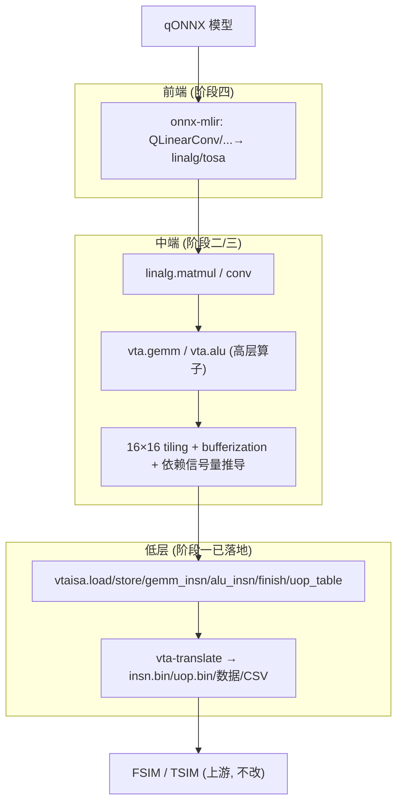
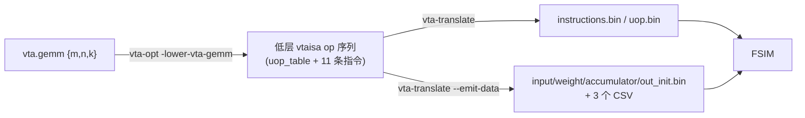

# MLIR-VTA 设计文档

> **文档定位：** 本文是 MLIR-VTA 编译器的**架构与设计说明**，讲清「为什么这样分层、每个模块负责什么、接口长什么样、如何向后续阶段扩展」。
> - 分阶段、可执行的任务清单见 [`plans/2026-06-02-mlir-vta-phase1-gemm.md`](plans/2026-06-02-mlir-vta-phase1-gemm.md)；
> - 构建与运行命令见 [`../README.md`](../README.md)；
> - VTA ISA 位域权威定义见上游 [`standalone-vta/docs/VTA_ISA_REFERENCE_cn.md`](../../standalone-vta/docs/VTA_ISA_REFERENCE_cn.md)。
>
> 若代码与本文不一致，**以源码为准**，并同步更新本文。

---

## 1. 背景与目标

### 1.1 要替换什么

上游 `standalone-vta` 用一套**纯 Python 两阶段编译器**把神经网络降到 VTA 加速器指令：

```
qONNX ─► vta_backend.py (NN 编译器) ─► VTA IR (JSON) ─► main_vta_compiler.py (VTA 编译器) ─► insn.bin/uop.bin ─► FSIM / TSIM
```

它的三个核心环节是手写启发式：
- **中间 IR** 是临时 JSON 约定，无类型、无校验；
- **分块策略** `matrix_partitioning`（STRATEGY 1–4）是手写规则；
- **依赖握手**（Load/Compute/Store 的 push/pop 信号量）靠手工计数器维护。

### 1.2 为什么用 MLIR

VTA 本质是「GEMM/ALU + 显式 SRAM 分块 + 双层循环 ISA」，正好命中 MLIR 的强项：可验证的自定义 IR、成熟的 tiling/bufferization 基础设施、标准化的 lowering 与 translate 框架、以及 `onnx-mlir` 现成前端。目标是**长期替换** Python 工具链，并以可扩展、可测试的方式支撑更大网络与更灵活的硬件配置。

### 1.3 不变量：下游仿真器原样复用

`standalone-vta` 的功能仿真器（FSIM）与周期精确仿真器（TSIM）**完全不动**。MLIR-VTA 只要产出**字节级一致**的 `instructions.bin` / `uop.bin` / 数据 bin / CSV，即可被现有仿真器直接消费。这把「正确性」变成可机械验证的 `cmp`，是整个设计的地基。

---

## 2. 总体架构

### 2.1 四阶段愿景



| 阶段 | 范围 | 状态 |
|------|------|------|
| **一** | `vtaisa` 低层 op + 二进制/数据/CSV 发射器 + 单块 `vta.gemm` 展开；16×16 GEMM 字节级复刻 + FSIM 通过 | ✅ 已完成 |
| **二** | `linalg.matmul → vta.gemm` 的 16×16 tiling + bufferization（对齐 `dram_allocation`）；通用维度 GEMM | 规划中 |
| **三** | 依赖信号量自动推导 pass；ALU（ReLU/池化）lowering；大矩阵 `matrix_partitioning` 等价的 tiling 策略 | 规划中 |
| **四** | `onnx-mlir` 前端；整网（LeNet-5）端到端；替换 Python 工具链 | 规划中 |

### 2.2 阶段一已落地的数据流



---

## 3. Dialect 设计（`vta` 高层 + `vtaisa` 低层）

项目用**两个独立 dialect** 分别承载两个抽象层次：

| dialect | name | C++ 命名空间 | 声明文件 | 角色 |
|---------|------|--------------|----------|------|
| **高层** | `vta` | `::mlir::vta` | [`Dialect/VTA/VTADialect.td`](../include/mlir-vta/Dialect/VTA/VTADialect.td)、[`VTAOps.td`](../include/mlir-vta/Dialect/VTA/VTAOps.td) | 张量级算子（`vta.gemm`，未来 `vta.alu` 等）|
| **低层** | `vtaisa` | `::mlir::vtaisa` | [`Dialect/VTAISA/VTAISADialect.td`](../include/mlir-vta/Dialect/VTAISA/VTAISADialect.td)、[`VTAISAOps.td`](../include/mlir-vta/Dialect/VTAISA/VTAISAOps.td)、[`VTAISAEnums.td`](../include/mlir-vta/Dialect/VTAISA/VTAISAEnums.td) | 与 ISA 一一对应的指令 op |

### 3.1 两层设计理念

| 层 | op | 角色 | 特点 |
|----|-----|------|------|
| **高层 `vta`** | `vta.gemm`（未来 `vta.alu` 等） | 表达「算什么」的张量级算子 | 便于做 tiling / fusion / 通用化；阶段二/三的 lowering 入口 |
| **低层 `vtaisa`** | `vtaisa.load`/`store`/`gemm_insn`/`alu_insn`/`finish`/`uop_table` | 与 128-bit 宏指令 / 32-bit UOP **一一对应** | 纯属性、无 SSA operand，便于无歧义地发射二进制 |

把「高层算子」与「低层 ISA op」拆成**两个 dialect**（而非同一 dialect 内的两类 op），是 MLIR 加速器后端的常见范式：`vta` 留给优化与通用化，`vtaisa` 贴近硬件、保证可发射性。`vta.gemm` 经 `-lower-vta-gemm` pass 下降为一串 `vtaisa.*` 指令；发射器只认 `vtaisa` op，遇到未降级的 `vta.gemm` 会显式报错。

### 3.2 为什么低层 op 用「纯属性、无 operand」

低层 op 的语义已由其属性完全确定（它们对应的是已经排好地址、定好循环边界的机器指令）。用 SSA value 表达数据流在这一层没有收益，反而会让「op ↔ 指令位域」的映射变复杂。因此低层 op：
- 不接收/产生 SSA value（`() -> ()`）；
- 所有 ISA 字段都是命名属性，名称与 ISA 字段、Python 编译器字段**三处同名**（如 `dst_factor_out`、`x_pad_left`），交叉对照成本最低；
- `assemblyFormat = "attr-dict"`，文本形态就是属性字典，round-trip 直观。

它们按出现顺序排列在 module body 里，发射器顺序遍历即得指令流（见 §5）。

### 3.3 低层 `vtaisa` op 字段一览

布尔依赖位 `pop_prev/pop_next/push_prev/push_next` 默认 `false`；所有整数字段为 `I64Attr`，标注「默认 0」者用 `DefaultValuedAttr<I64Attr,"0">`。

| op | opcode | 关键属性 |
|----|:------:|----------|
| `vtaisa.load` | 0 | `buffer_id`(枚举)、4 依赖位、`sram_base`、`dram_base`、`y_size`、`x_size`、`x_stride`、`y_pad_top/bottom`、`x_pad_left/right` |
| `vtaisa.store` | 1 | `buffer_id`、4 依赖位、`sram_base`、`dram_base`、`y_size`、`x_size`、`x_stride` |
| `vtaisa.gemm_insn` | 2 | 4 依赖位、`reset`、`uop_bgn/end`、`loop_out/in`、`dst/src/wgt_factor_out/in`（6 个步进因子） |
| `vtaisa.alu_insn` | 4 | 4 依赖位、`reset`、`uop_bgn/end`、`loop_out/in`、`dst/src_factor_out/in`、`alu_opcode`、`use_imm`、`imm` |
| `vtaisa.finish` | 3 | 无属性（发射为全零 `VTAMemInsn`，opcode=3） |
| `vtaisa.uop_table` | — | `dst`、`src`、`wgt` 三个 `I64ArrayAttr`（每条 UOP 一组三元组） |

### 3.4 `BufferId` 枚举

[`VTAISAEnums.td`](../include/mlir-vta/Dialect/VTAISA/VTAISAEnums.td) 用 `I64EnumAttr` 定义片上缓冲类型，底层整数值即 ISA 的 `buffer_id`：

| 枚举 | 值 | 含义 |
|------|:--:|------|
| `UOP` | 0 | 微操作缓存 |
| `WGT` | 1 | 权重 buffer |
| `INP` | 2 | 输入激活 buffer |
| `ACC` | 3 | 累加器 buffer |
| `OUT` | 4 | 输出 buffer（STORE 目标） |

枚举类型化让 lowering 端用强类型 `vtaisa::BufferId::INP` 构造、发射端用 `static_cast<uint64_t>(...)` 取值，既可读又零歧义。

### 3.5 `uop_table` 的设计

一次计算需要一张 UOP 表。把它建模为单个 `vtaisa.uop_table` op、用三个等长 I64 数组承载所有 UOP（而非每条 UOP 一个 op），原因：
- UOP 表是连续内存块，整体性强，单 op 更贴合语义；
- 发射器一次性把它写成 `uop.bin`，与宏指令的 `[uop_bgn, uop_end)` 索引解耦；
- 数组等长是硬性约束，发射器对此做显式校验（不等长则报错，见 §5.4）。

### 3.6 高层 `vta.gemm`

阶段一引入的高层算子，仅带 `m`/`n`/`k` 三个 `I64Attr`，表示一次（当前限定 16×16×16）矩阵乘。它是 lowering 的输入；阶段二会扩展其语义（接收 memref/tensor operand、支持任意维度），并由 tiling 决定如何切成 16×16 块。

---

## 4. 与 VTA ISA 的位域映射

低层 op 属性 → 128-bit 指令 / 32-bit UOP 的精确 bit 区间（小端、`_pack_=1`，从 bit 0 起递增填充），与上游 `structures.py` 完全一致。这是发射器 [`VTABinaryEmitter.cpp`](../lib/Target/VTABinaryEmitter.cpp) 的权威依据。

**VTAUop（32 bit）：** `dst_idx[0,11) src_idx[11,22) wgt_idx[22,32)`

**VTAMemInsn（LOAD=0 / STORE=1 / FINISH=3）：**
```
w0: opcode[0,3) pop_prev[3] pop_next[4] push_prev[5] push_next[6]
    buffer_id[7,10) sram_base[10,26) dram_base[26,58) unused[58,64)
w1: y_size[0,16) x_size[16,32) x_stride[32,48)
    y_pad_top[48,52) y_pad_bottom[52,56) x_pad_left[56,60) x_pad_right[60,64)
```

**VTAGemInsn（opcode=2）：**
```
w0: opcode[0,3) pop_prev[3] pop_next[4] push_prev[5] push_next[6] reset[7]
    uop_bgn[8,21) uop_end[21,35) loop_out[35,49) loop_in[49,63) unused[63]
w1: dst_factor_out[0,11) dst_factor_in[11,22) src_factor_out[22,33)
    src_factor_in[33,44) wgt_factor_out[44,54) wgt_factor_in[54,64)
```

**VTAAluInsn（opcode=4）：** w0 同 GEMM 前缀；
```
w1: dst_factor_out[0,11) dst_factor_in[11,22) src_factor_out[22,33)
    src_factor_in[33,44) alu_opcode[44,47) use_imm[47] imm[48,64)
```

---

## 5. 二进制发射器（`VTABinaryEmitter`）

文件：[`lib/Target/VTABinaryEmitter.cpp`](../lib/Target/VTABinaryEmitter.cpp)，接口 [`include/mlir-vta/Target/VTABinaryEmitter.h`](../include/mlir-vta/Target/VTABinaryEmitter.h)。入口 `LogicalResult emitBinary(ModuleOp, StringRef outDir)`。

### 5.1 位打包基元

```cpp
static inline void setBits(uint64_t &word, unsigned lo, unsigned width, uint64_t val) {
  uint64_t mask = (width == 64) ? ~0ULL : ((1ULL << width) - 1);
  assert((width == 64 || val <= mask) && "VTA field value exceeds bit width");
  word |= (val & mask) << lo;
}
```
`assert` 在 debug 构建捕获字段越界——阶段一全是黄金常量不会触发，但阶段二自动生成 `uop_bgn`(13bit)、`dram_base`(32bit) 等时，这是第一道防线。

### 5.2 pack 函数族

- `packMem(MemFields) → array<uint64_t,2>`：LOAD/STORE/FINISH。
- `packGemm(GemmFields)` / `packAlu(AluFields)`：共用 `packLoopPrefix` 填 w0 的公共前缀（opcode…loop_in），各自填 w1 的步进因子 / ALU 字段。
- `packUop(dst,src,wgt) → uint32_t`。

每个 `setBits` 调用都对照 §4 的 bit 区间，逐字段写死。

### 5.3 小端序列化（可移植）

```cpp
static void appendInsn(std::vector<uint8_t>&, const std::array<uint64_t,2>& words);
static void appendUop (std::vector<uint8_t>&, uint32_t u);
```
显式用 `(w >> (8*i)) & 0xFF` 逐字节输出小端，**不依赖宿主端序或结构体内存布局**——比直接 `write(&word, 8)` 更安全，在大端机上同样正确。

### 5.4 遍历与 fail-loud

`emitBinary` 顺序遍历 `module.getBody()`：
- `vtaisa.uop_table` → 校验三数组等长（否则 `emitError` + `failure()`），逐条 `packUop` 追加到 `uopBuf`；
- `vtaisa.load/store/gemm_insn/alu_insn` → 读对应 op 的属性访问器（LLVM 13 为 snake_case，如 `l.dram_base()`、`l.buffer_id()`），pack 后 16 字节追加到 `insnBuf`；
- `vtaisa.finish` → 全零 `packMem(opcode=3)`；
- **终结符**（`OpTrait::IsTerminator`）→ 跳过；
- **其它 `vta`/`vtaisa` 命名空间的 op**（如未 lower 的 `vta.gemm`）→ `emitOpError("unhandled vta/vtaisa op ...")` + `failure()`，**绝不静默丢弃**；
- 非 vta/vtaisa、非终结符 op → 忽略。

最后写 `outDir/instructions.bin`、`outDir/uop.bin`，`writeFile` 检查 `raw_fd_ostream` 错误状态。

> **设计要点：** 「未识别 vta op 报错」是阶段二的关键护栏——一旦有人忘了先跑 lowering，会立即失败而不是产出一段错误二进制。

---

## 6. 数据 / CSV 发射器（`VTADataEmitter`）

文件：[`lib/Target/VTADataEmitter.cpp`](../lib/Target/VTADataEmitter.cpp)。入口 `emitData(inputPath, weightPath, outDir)`。针对单块 16×16 int32：

| 文件 | 规则 |
|------|------|
| `input.bin` | 原样拷贝（单块无需重排） |
| `weight.bin` | 转置 `W[r][c] → out[c][r]`，行主序写出 |
| `accumulator.bin` / `out_init.bin` | 256 个 int32 零 |
| `metadata.csv` / `memory_addresses.csv` / `layers_name.csv` | 硬编码文本，**行尾用 CRLF（`\r\n`）** |

> **关键坑：** Python `csv` 模块用 CRLF 行尾。用 `\n` 会导致 CSV 第一行就字节不匹配。

转置与零填充都是「读 int32 → 写 int32」的对称操作，按字节保序，故数据路径端序无关。

---

## 7. Lowering：`LowerVTAGemm` pass

文件：[`lib/Transforms/LowerVTAGemm.cpp`](../lib/Transforms/LowerVTAGemm.cpp)，声明 [`VTAPasses.h`](../include/mlir-vta/Dialect/VTA/VTAPasses.h)。

- 形态：`PassWrapper<LowerVTAGemmPass, OperationPass<ModuleOp>>`，命令行参数 `-lower-vta-gemm`（由 `registerVTAPasses()` 注册，`vta-opt` 启动时调用）。
- 逻辑：`module.walk` 收集所有 `vta::GemmOp`；对每个先守卫 `m==n==k==16`（否则 `emitError` + `signalPassFailure`），再用 `OpBuilder` 在原位按固定顺序创建 `uop_table` + 11 条低层 op + `finish`，最后 `g.erase()`。
- 生成的 11 条指令字段（含依赖位、`dram_base` 等）直接取自 Python 编译器对 16×16 GEMM 的输出（对应 `memory_addresses.csv` 的地址布局）。

### 7.1 当前限制 vs 阶段二通用化

阶段一**硬编码**单块序列，是为了先用最简单的方式锁死「lowering → 发射 → 字节一致」的链路正确性。阶段二会把它替换为**数据驱动**：


硬编码的 `dram_base=5120/64/8/192/...` 将由地址分配 pass 计算；固定的依赖位将由依赖推导 pass 生成（见 §10）。

---

## 8. 工具与构建

### 8.1 工具

| 工具 | 文件 | 作用 |
|------|------|------|
| `vta-opt` | [`tools/vta-opt/vta-opt.cpp`](../tools/vta-opt/vta-opt.cpp) | 注册 `vta` + `vtaisa` 两个 dialect 与 pass 的 `mlir-opt` 变体；跑 `-lower-vta-gemm`、round-trip |
| `vta-translate` | [`tools/vta-translate/vta-translate.cpp`](../tools/vta-translate/vta-translate.cpp) | 解析 `.mlir` → `emitBinary`（+ `--emit-data` → `emitData`） |

`vta-translate` CLI：`vta-translate <input.mlir> -o <outDir> [--emit-data --input <inp.bin> --weight <wgt.bin>]`。用 LLVM 13 的 `mlir::parseSourceFile<ModuleOp>`（头文件 `mlir/Parser.h`）。

### 8.2 构建系统

CMake `find_package(MLIR REQUIRED CONFIG)`，依赖系统预装的 **LLVM/MLIR 13.0.0**（`/usr/local/llvm`）。子目录：`include/.../VTA`（TableGen）、`lib/Dialect/VTA`、`lib/Target`、`lib/Transforms`、`tools/*`。生成器用 `Unix Makefiles`（无 ninja），编译器用 `clang++`（与 LLVM 13 ABI 匹配）。

**已记录的 LLVM 13 适配点：** `.td` 中 trait 列表用 `list<OpTrait>`；`MlirOptMain.h` 在 `mlir/Support/`；`DialectRegistry` 在 `mlir/IR/Dialect.h`；op 访问器是 snake_case 无 `get` 前缀（`l.dram_base()`）；`parseSourceFile<ModuleOp>` 返回 `OwningOpRef<ModuleOp>`。

---

## 9. 验证策略

| 层级 | 手段 | 文件 |
|------|------|------|
| dialect round-trip | `vta-opt %s \| vta-opt` + `grep`（环境无 `FileCheck`） | `test/Dialect/*.mlir` |
| 指令/UOP 字节级 | `cmp` 对比黄金参考 | `test/Target/gemm16x16.mlir`、`test/golden/{instructions,uop}.bin` |
| 数据/CSV 字节级 | `cmp` 对比 Python 重新生成的输出 | `scripts/make_golden.sh` |
| 端到端 | lower → translate → `cmp` 黄金参考 | `test/Target/lower_gemm.mlir` |
| 仿真 | 喂 FSIM 跑出结果矩阵 + profiler | `scripts/run_fsim.sh` |

黄金参考由 [`scripts/make_golden.sh`](../scripts/make_golden.sh) 用**固定随机种子**调用 Python 编译器生成并提交到 `test/golden/`，保证可复现。指令序列与数据值无关（确定性），故可作字节基线。

---

## 10. 阶段二/三/四扩展设计

### 10.1 阶段二：`linalg.matmul → vta.gemm` + tiling + bufferization

- 扩展 `vta.gemm` 接收 `memref`/`tensor` operand 与任意 `m,n,k`。
- 用 MLIR 上游 `linalg` tiling 把大 matmul 切成 16×16 块、K 维 reduce；tile size 由硬件配置（`LOG_BLOCK` 等，建模为 dialect 级属性）决定。
- 新增**地址分配 pass**，复刻 `dram_allocation`：按 4 KiB 页对齐为 INP/WGT/ACC/OUT/UOP/INSN 排物理/逻辑地址，产出 `memory_addresses.csv`。
- 用 `bufferization` 把 tensor 语义降到 memref，与 SRAM/DRAM 缓冲对应。

### 10.2 阶段三：依赖信号量推导 pass（最难）

这是 Python 编译器里唯一没有现成 MLIR 能力直接覆盖的部分。设计草图：
- 把 Load/Compute/Store 视作三阶段流水线，对每条低层指令访问的 SRAM 区间做依赖分析；
- 维护四个方向的 token 队列（`LD->CMP`/`CMP->LD`/`CMP->ST`/`ST->CMP`），在成对的生产/消费指令上设置 `push_*`/`pop_*` 位；
- 必要处插入 `y_size=x_size=0` 的 NOP 排空指令（对应阶段一硬编码序列里的 I8/I9）。
- 可借助 MLIR async/token 建模，或实现为独立的 dataflow 分析 pass。

同时为低层 op 补 **verifier**，把 §5.1 的 `setBits` 断言提升为 IR 级字段范围校验（阶段二自动生成字段后最先受益）。

### 10.3 阶段三：ALU lowering

高层 `vta.alu`（ReLU=MAX imm0、池化=ADD+SHR 等）→ `vtaisa.alu_insn` + `vtaisa.uop_table`。`vtaisa.alu_insn` / `packAlu` 已就绪，只缺 lowering 与测试覆盖。

### 10.4 阶段四：`onnx-mlir` 前端

接入 `onnx-mlir`，把 `QLinearConv`/`QLinearMul`/`MaxPool`/`Relu` 等降到 `linalg`/`tosa`，再进入阶段二/三管线；量化 rescale、CPU 回退算子（`QLinearAdd`/`Concat`）按上游 `dependency.csv` 的约定处理。

---

## 11. 已知限制与技术债

| 项 | 说明 | 计划 |
|----|------|------|
| `LowerVTAGemm` 仅支持 16×16×16 | 单块硬编码；非此尺寸报错 | 阶段二通用化 |
| 字段范围仅 `assert` 校验 | debug 构建捕获越界，无 IR verifier | 阶段三补 op verifier |
| `alu_insn` 无 lowering/测试覆盖 | op 与发射器已实现但未被使用 | 阶段三 ALU lowering |
| 无 `lit`/CTest 装配 | 测试靠脚本 `cmp`/`grep` 手跑 | 可选：加最小 lit 配置 |
| 数据发射器仅单块 16×16 | `emitData` 写死维度与零填充 | 阶段二随分块通用化 |

---

## 12. 文件索引

| 路径 | 内容 |
|------|------|
| `include/mlir-vta/Dialect/VTA/VTADialect.td` | 高层 `vta` dialect 声明 |
| `include/mlir-vta/Dialect/VTA/VTAOps.td` | 高层 op 定义（`vta.gemm`）|
| `include/mlir-vta/Dialect/VTA/VTAPasses.h` | pass 注册接口 |
| `include/mlir-vta/Dialect/VTAISA/VTAISADialect.td` | 低层 `vtaisa` dialect 声明 |
| `include/mlir-vta/Dialect/VTAISA/VTAISAOps.td` | 低层 ISA op 定义 |
| `include/mlir-vta/Dialect/VTAISA/VTAISAEnums.td` | `BufferId` 枚举 |
| `lib/Dialect/VTA/` `lib/Dialect/VTAISA/` | 两个 dialect + op 实现 |
| `lib/Target/VTABinaryEmitter.cpp` | 指令/UOP 位域打包与发射 |
| `lib/Target/VTADataEmitter.cpp` | 数据 bin + CSV 发射 |
| `lib/Transforms/LowerVTAGemm.cpp` | 单块 `vta.gemm` → `vtaisa.*` 展开 pass |
| `tools/vta-opt/` `tools/vta-translate/` | 命令行工具 |
| `test/` | round-trip、字节级用例、黄金 fixtures |
| `scripts/make_golden.sh` `scripts/run_fsim.sh` | 黄金参考生成、FSIM 端到端 |
| `docs/plans/2026-06-02-mlir-vta-phase1-gemm.md` | 阶段一实施计划（含黄金参考与位域规范） |
