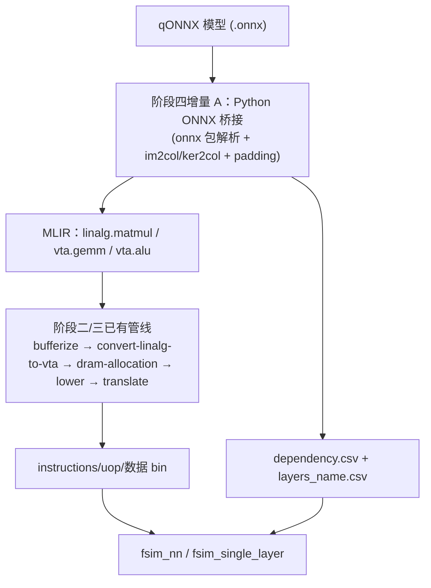

# MLIR-VTA 阶段四设计规格 · ONNX 前端与整网端到端

> **状态：** 增量 A–C/E 已落地（2026-06-05）。增量 E 含 QLinearMul FSIM + Conv+Relu 数值 golden。  
> **下一步：** 增量 **F → G**（CPU 算子 + LeNet-5 整网）；增量 **D**（onnx-mlir）暂缓。

---

## 1. 背景与目标

阶段一–三已落地：`vta.gemm` / `vta.alu` lowering、通用 GEMM（16 倍数维）、多层 DRAM 分配、Overfit Strategy 1–4、信号量推导、ALU lowering、`fsim_nn` 两层 GEMM 串联（256/256 一致）。

阶段四要把 **qONNX 整网** 接入 MLIR 编译器，最终产出与上游 **字节级一致** 的 `instructions*.bin` / `uop*.bin` / 数据 bin / `dependency.csv`，供 `fsim_nn` / TSIM 直接消费。

### 1.1 不变量

- 下游 FSIM/TSIM **不改**；正确性 = 字节级 `cmp` + FSIM 数值校验。
- 卷积 → Im2Col + ker2col → GEMM 的数学约定与上游一致（见 `standalone-vta/docs/nn_compiler_cn.md` §3.1）。
- `dependency.csv` 格式与上游 `vta_backend.py` 输出 **字段级兼容**（见 `standalone-vta/docs/dependency_csv详解.md`）。

### 1.2 不在本阶段范围

- TSIM 周期精确断言；
- 完整 `onnx-mlir` C++ 链接（**增量 D，暂缓**：待本地 onnx-mlir 环境就绪；当前用 Python ONNX 桥接验证管线）；
- 训练/量化工具链。

---

## 2. 总体架构

**长期（增量 D）：** 用 `onnx-mlir` 替换 Python 桥接，把 `QLinearConv`/`MaxPool`/`Relu` 等降到 `linalg`/`tosa`，再进入同一中端管线。

---

## 3. 子系统拆分

| 子系统 | 职责 | 首增量状态 |
|--------|------|------------|
| **A. ONNX 解析桥接** | 读 qONNX，Im2Col/ker2col，写 padded raw bin + MLIR 入口 | ✅ 增量 A |
| **B. dependency.csv 发射** | 按层元数据写整网调度 CSV | ✅ 增量 A |
| **C. 非 16 倍数行维** | 上游 A 矩阵仅列 padding（如 25×32）；col-pad + expand_bias 已落地 | ✅ 增量 B |
| **D. onnx-mlir 接入** | C++ 前端，QLinearConv → linalg | ⏸ 暂缓 |
| **E. MaxPool / Relu / QLinearMul / Conv+Relu** | → `vta.alu` / `vta.maxpool` / `vta.gemm{mul_constant}` + fsim_nn | ✅ 增量 E |
| **F. CPU 回退算子** | QLinearAdd / Concat → dependency.csv `processor=qadd|concat` | 🔄 进行中 |
| **G. LeNet-5 整网** | 多层 ONNX → fsim_nn 端到端 vs reference.bin | ⏳ 待 F |

---

## 4. 增量 A：单层 QLinearConv（qlinearconv_debug.onnx）

### 4.1 模型参数

| 项 | 值 |
|----|-----|
| 输入 NCHW | `[1, 3, 5, 5]` int8 |
| 卷积核 | 3×3，same pad，stride 1 |
| 输出 NCHW | `[1, 3, 5, 5]` |
| Im2Col A | 25×27 |
| ker2col B | 27×3 |
| 偏置 X | 1×3（VTA 编译期 `doExpandBias` 广播） |
| STRATEGY | 2（上游 `node_conv.py` 硬编码） |

### 4.2 Padding 策略（对齐上游 `data_definition.py`）

| 矩阵 | 原始 | 列/行 padding 规则 | padded |
|------|------|-------------------|--------|
| A (INP) | 25×27 | 仅列 → 32 | 25×32 |
| B (WGT) | 27×3 | 方阵 padding | 32×16 |
| X/C | 25×3 / 1×3 | 列 + 行（WGT 规则） | 32×16 |

**mlir-vta 限制：** `vta.gemm` verifier 要求 M/K/N 均为 16 倍数。增量 A 对 **行维也 pad 到 32**（25→32 补零行），保证可走现有 lowering；有效 25 行结果与 numpy 参考一致。与上游 **字节级** 对齐留待增量 B（partial row block + LOAD pad 位）。

### 4.3 交付物

| 路径 | 说明 |
|------|------|
| `scripts/onnx_qconv_bridge.py` | ONNX → raw bin + MLIR + node_info |
| `scripts/emit_dependency_csv.py` | node_info → dependency.csv |
| `scripts/run_onnx_qconv.sh` | 桥接 → vta-opt → vta-translate → FSIM 数值校验 |
| `scripts/make_golden_onnx_qconv.sh` | 上游 VTA 编译器生成黄金（可选字节级 cmp） |
| `test/Target/qlinearconv_padded.mlir` | 32×32×16 padded GEMM 入口 IR |

### 4.4 验收

1. `scripts/run_onnx_qconv.sh` 非零退出即失败；
2. FSIM 结果矩阵前 25×3 有效区与 numpy `im2col @ ker2col + bias` 一致；
3. （可选）与上游 padded JSON 编译产物 `instructions.bin` 字节级 `cmp`。

---

## 5. 后续增量路线图

| 增量 | 内容 | 状态 |
|------|------|------|
| **B** | partial row block（25×32 不 pad 行）+ LOAD `y_pad` 位 | ✅ |
| **C** | `two_qlinearconv` 两层 + fsim_nn | ✅ |
| **E** | MaxPool/Relu/QLinearMul/Conv+Relu | ✅ |
| **F** | QLinearAdd/Concat CPU 节点 + fsim_nn 混合调度 | 🔄 **当前** |
| **G** | LeNet-5 整网 `final_output.bin` vs `reference.bin` | ⏳ 待 F |
| **D** | onnx-mlir spike + QLinearConv → linalg | ⏸ 暂缓（无本地 onnx-mlir） |

实施计划见 [`plans/phase4-increment-FG.md`](plans/phase4-increment-FG.md)。

---

## 6. 验证策略

| 层级 | 手段 |
|------|------|
| 桥接单元 | Python：im2col/ker2col 维度与 upstream `tensor_matrix_converter` 一致 |
| MLIR 管道 | `vta-opt` → `vta-translate`，无 unhandled op 报错 |
| 字节级 | `cmp` 上游黄金（padded 维一致时） |
| FSIM 数值 | `fsim_single_layer` / `fsim_nn` 结果 vs numpy / reference.bin |
| 整网 | `make run` 等价：`final_output.bin` vs `reference.bin` |

---

## 7. 参考文档

- [`DESIGN_cn.md`](../DESIGN_cn.md) §10.4
- [`standalone-vta/docs/nn_compiler_cn.md`](../../../standalone-vta/docs/nn_compiler_cn.md)
- [`standalone-vta/docs/dependency_csv详解.md`](../../../standalone-vta/docs/dependency_csv详解.md)
- [`standalone-vta/docs/MAKE_ONNX_RUN_cn.md`](../../../standalone-vta/docs/MAKE_ONNX_RUN_cn.md)
